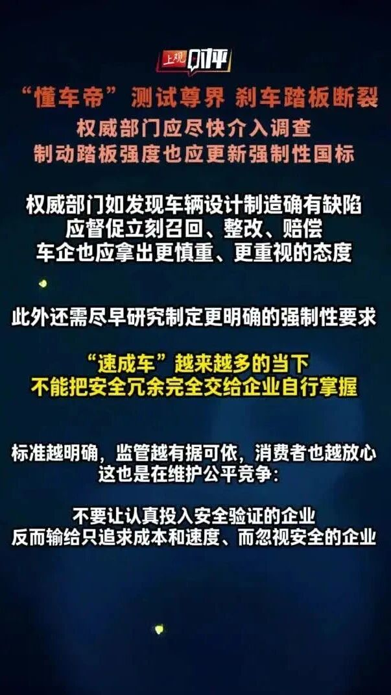

# “懂车帝”测试尊界：刹车踏板断裂！上观时评：权威部门应尽快介入，不能把安全标准交给企业自行掌握

- 公众号：上观新闻

- 原文：https://mp.weixin.qq.com/s?src=11&timestamp=1791634081&ver=7018&signature=a0*bQfs-skRYlm*isSJiTjkcaTabWJVtHhwG7UNEG*hhZOCXUpyfDpwrhnHl7PgxItfAncc8eOpGkLkzuDQEAzVi3NZvcK3Tv9l*9ZT-D*tn2SSecAP2FqcHIATJOxt2&new=1

- 页面保存方式：Windows Chrome「网页，完整」

## 正文配图

页面另有一张上观新闻小程序推广二维码图，已保存供核对，不建议作为视频素材：

## 正文文字

安全是汽车最重要的属性

刹车一旦踩断 车辆失去制动 后果不堪设想！

现行国标只要求踏板“具有足够强度”

有模糊地带 就可能有企业钻空子

面对争议

需要公开、统一、可量化、可验证的规则

厘清是非、一锤定音

权威部门如果发现车辆设计制造确有缺陷

应督促立刻召回、整改、赔偿

车企也应拿出更慎重、更重视的态度

此外还需尽早研究制定更明确的强制性要求

在“速成车”越来越多的当下

不能把安全冗余完全交给企业自行掌握

标准越明确，监管越有据可依，消费者也越放心

这也是在维护公平竞争：

不能让认真投入安全验证的企业

反而输给只追求成本和速度、却忽视安全的企业
